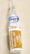
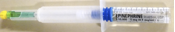

Vasopressors and Inoconstrictors - Quick Review    body {font-family: 'Open Sans', sans-serif;}

### Vasopressors and Inoconstrictors - Quick Review

Vasopressors are a class of drugs that produce vasoconstriction and a subsequent increase in systemic vascular resistance (SVR) and mean arterial pressure (MAP).  
DO NOT confuse vasopressors with inotropic drugs that increase cardiac contractility.  
However, some vasopressors also increase cardiac contractility (inoconstrictors) which are usually dose dependent.  
**Vasoactive agent:** A drug that may induce both inotropic and vasopressor actions.  
  
Vasopressors are often used in cardiopulmonary resuscitation and circulatory related shock.  
  
**Vasopressors may be:  
**Pure vasoconstrictors  
Inoconstrictors  
  
**Vasopressor actions are mediated via alpha 1 receptors resulting in:**  
Increase in arterial and venous smooth muscle contraction.  
Increase in SVR.  
Increased pulmonary vascular resistance and venous return.  
Increased venous return.  
  
**Pure Vasoconstrictors  
**Vasopressin  
Phenylephrine  
  
**Inoconstrictors  
**Norepinephrine  
Epinephrine  
Dopamine  
Ephedrine  
  
**Pure Vasoconstrictors:**  
**Vasopressin (pitressin, ADH)** table.tableizer-table { font-size: 12px; border: 1px solid #CCC; font-family: Arial, Helvetica, sans-serif; } .tableizer-table td { padding: 4px; margin: 3px; border: 1px solid #CCC; } .tableizer-table th { background-color: #104E8B; color: #FFF; font-weight: bold; }

|  |
| --- |
| Vasopressin1 and vasopressin2 receptor agonist. |
| Naturally produced in the hypothalamus and secreted into the circulation through the posterior pituitary gland during times of hyperosmolar plasma/urine, hypotension, and hypovolemia (circulatory shock). |
| Causes a substantial vasoconstriction in skin, skeletal muscle, fat, and mesenteric blood vessels, and predominantly increases systemic vascular resistance, shifting the blood flow from non-vital to vital organs as a passive effect. |
| Intraoperative pressor of choice for patients with pulmonary hypertension or right ventricular failure because it has no to little effect on the pulmonary vessels. |
| This nonadrenergic drug is optimal for post induction hypotensive patients who have a blunted renin-angiotensin system from ACE Inhibitors resulting in a refractory to phenylephrine and ephedrine. |
| Utilized in institutional protocols of certain forms of sepsis. |
|   
 |
| **Other uses:** Diabetes insipidus or variceal bleeding. |
| **Receptors:** ADH analogue. |
| **PVR effect:** Minimal to none. |
| **SVR:** Increased significantly. |
| **Cardiac index:** Increased. |
| **CVP:** No change. |
| **HR:** No effect. |
| **Systolic and diastolic function:** No effect. |
| **Ventricular activity:** No direct effect. |
| **Myocardial oxygen demand:** No effect. |
| **Splanchnic vasoconstriction:** Yes. |
| **Coronary vasoconstriction:** At higher doses. |
|   |
| Common doses of vasopressin for hypotension |
| Rescue pressor of choice for pulmonary hypertension |
| 1-2 units IV push for intraoperative refractory hypotension. |
|   |
| **Septic shock:** 0.01 to 0.2 units/min (concomitantly with Levophed) |
| **Bleeding esophageal varices:** 0.2 to 0.4 units (max 0.8 units per min) |

  
  
**Phenylephrine (Neosynephrine)** table.tableizer-table { font-size: 12px; border: 1px solid #CCC; font-family: Arial, Helvetica, sans-serif; } .tableizer-table td { padding: 4px; margin: 3px; border: 1px solid #CCC; } .tableizer-table th { background-color: #104E8B; color: #FFF; font-weight: bold; }

|  |
| --- |
| Alpha adrenergic agonist |
| The most common vasopressor administered by anesthesia providers intraoperatively. |
| Stimulates ONLY alpha 1 receptors resulting in an increase in SVR, MAP, venous return and possible baroreceptor-mediated reflex bradycardia. |
| An optimal infusion for CAD patients because it increases coronary filling time and coronary perfusion pressure due to reflex bradycardia and an increased SVR respectively. |
| A good drug for treating hypotension cause by a tachyarrhythmia. |
|   
 |
| **Receptors:** Strong alpha-1 |
| **SVR:** Increased significantly |
| **Cardiac Index:** Decrease |
| **PAP:** Increase |
| **CVP:** Increase |
| **BP:** Increases |
| **HR:** Possible reflex bradycardia |
| **Systolic or diastolic function:** none |
| **Cardiac output:** May be decreased |
| **Myocardial oxygen demand:** Not usually |
|   
 |
| **Common doses of phenylephrine for intraoperative hypotension** |
| 40-100 mcg bolus |
| Manual infusion: Titrate to effect |
| Infusion rates: 10 to 200 mcg/minute or 0.1 to 2 mcg/kg/minute |

  
  
  
**Inoconstrictors:  
Norepinephrine (Levophed)** table.tableizer-table { font-size: 12px; border: 1px solid #CCC; font-family: Arial, Helvetica, sans-serif; } .tableizer-table td { padding: 4px; margin: 3px; border: 1px solid #CCC; } .tableizer-table th { background-color: #104E8B; color: #FFF; font-weight: bold; }

|  |
| --- |
| **Class:** Symptomatic; alpha 1, alpha 2, and beta 1 adrenergic receptor agonist. |
| Minimal beta 2 agonist. |
| Produces powerful vasoconstriction. |
|   
 |
| **SVR:** Increase |
| **Cardiac Index:** Increase or decrease |
| **Diastolic function:** No change |
| **Oxygen demand:** Increase |
| **Renal perfusion:** Decreased |
| **Cardiac output:** Variable |
| **\+ Inotrope:** Yes |
| **PVR:** Increase minimally |
| **HR:** Decrease (alpha effects > beta effects) |
|   |
| **Indications** |
| Mostly used to treat septic shock. |
| May be drug of choice in hyperdynamic (normal CO) septic shock because of its ability to increase SVR and MAP, thus correcting the physiologic deficit of organ perfusion pressure compared with other pressors. |
|   |
| **Doses of Norepinephrine** |
| 1-30 mcg/min (2-4 most common) or |
| 0.5-2 mcg/kg/min for Refractory CHF or |
| 0.1-0.5 for documented ACLS |
| 0.01 to 0.3 mcg/kg/minute |

  
  
**Epinephrine** table.tableizer-table { font-size: 12px; border: 1px solid #CCC; font-family: Arial, Helvetica, sans-serif; } .tableizer-table td { padding: 4px; margin: 3px; border: 1px solid #CCC; } .tableizer-table th { background-color: #104E8B; color: #FFF; font-weight: bold; }

|  |
| --- |
| **Class:** Sympathomimetic, vasopressor |
| Direct alpha and beta adrenergic receptor agonist |
| Receptor activity (greatest to least): Beta 2 > Beta 1 > Alpha 2 > Alpha 1 |
|   
 |
| **\+ Inotrope:** Yes |
| **\+ Chronotrope:** Yes |
| **Bronchodilator:** Yes |
| **Renal blood flow:** Decrease |
| **Cardiac Index:** Increase |
| **Cardiac output:** Increase |
| **PAP:** Increase |
| **CVP:** Increase |
|   
 |
| **Indications:** |
| Hypotension |
| Shock |
| Heart failure |
| CHF |
| Bronchospasm |
| Cardiac arrest |
| Used with local anesthetic |
|   
 |
| **Epinephrine concentrations** |
| 1:1,000 = 1mg/mL (small 1 cc vials) |
| 1:10,000 = 0.1 mg (100 mcg)/mL |
| 1:100,000 = 10 mcg/mL |
| 1:200,000 = 5 mcg/mL |
| 1:400,000 = 2.5 mcg/mL |
| 
**** = 1:1,000 (1 mg/mL)

 |
| 

**** = 1:10,000 (0.1 mg/mL or 100 mcg/mL)

 |
|   |
| **Quick Mix for small boluses:** |
| Add one 1mg vial of epi (1:1,000) to a 250 cc bag of NS = 4mcg/cc. |
| Add one 1mg vial of epi (1:1,000) to a 100 cc bag of NS = 10 mcg/cc. |
|   
 |
| **Infusions:** |
| 2 to 10 mcg/minute (beta1 adrenergic, beta adrenergic) |
| 10 to 100 mcg/minute (alpha adrenergic) |

  
**Dopamine** table.tableizer-table { font-size: 12px; border: 1px solid #CCC; font-family: Arial, Helvetica, sans-serif; } .tableizer-table td { padding: 4px; margin: 3px; border: 1px solid #CCC; } .tableizer-table th { background-color: #104E8B; color: #FFF; font-weight: bold; }

|  |
| --- |
| **Class:** Inotrope/vasopressor |
| An immediate precursor to norepinephrine and is characterized by dose dependent effects on certain receptors. |
| Activates dopaminergic, alpha and beta adrenergic receptors. |
|   
 |
| **Doses:** |
| **2-5 mcg/kg/min:** (renal), dopaminergic receptors. Minimal cardiovascular effects. |
| **5-10 mcg/kg/min:** (cardiac) beta 1 > alpha receptors stimulation. |
| Promotes norepinephrine release and inhibits norepinephrine uptake resulting with increased HR, + inotrope and increase cardiac output |
| **10-20 mcg/kg/min:** Mainly pressor effect. Alpha receptor dominates. |
| Maximum dose 50 mcg/kg/min. |
| **\+ Inotrope:** Yes |
| **Diastolic function:** No effect |
| **\+ Chronotrope:** Yes |
| **Cardiac Index:** Increase |
| **Cardiac output:** Increase |
| **Increase in oxygen demand:** Minimal |
| **SVR:** Increase |
| **PAP:** Increase |
| **CVP:** Increase |
|   |
| Has recently been recommended for septic shock in patients with Hypodynamic (low CO) septic shock because it increases CO and MAP with minimal increases in SVR. |

  
  
**Ephedrine** table.tableizer-table { font-size: 12px; border: 1px solid #CCC; font-family: Arial, Helvetica, sans-serif; } .tableizer-table td { padding: 4px; margin: 3px; border: 1px solid #CCC; } .tableizer-table th { background-color: #104E8B; color: #FFF; font-weight: bold; }

|  |
| --- |
| **Class:** Vasopressor; non-catecholamine sympathomimetic; indirect; mixed alpha and beta agonist. |
| The second most common vasopressor administered intraoperatively. |
|   
 |
| **Mechanism of action:** |
| Ephedrine exerts direct and indirect actions. |
| **Direct acting:** an alpha, beta adrenergic agonist. |
| **Indirect acting:** Causes the release of norepinephrine and other endogenous catecholamines stored within nerve terminals. |
| Norepinephrine then activates the corresponding postsynaptic receptors to cause arterial and venous vasoconstriction. |
| The indirect effect is the predominant pharmacologic effect. |
| Tachyphylaxis may occur with repetitive doses of ephedrine due to the depletion of presynaptic stores of norepinephrine. |
| Cocaine is known to deplete presynaptic stores of norepinephrine. |
| The cardiovascular effects of ephedrine may be reduced by patients on cocaine. |
|   
 |
| **BP:** Increase |
| **HR:** Increase |
| **CO:** Increase |
| **MAP:** Increase |
| **PVR:** Increase |
| **Bronchodilation:** Yes |
| **Concentration:** Using a 5cc syringe, add 1cc of ephedrine (50mg/cc) to 4 cc of NS = 10mg/cc. |
|   
 |
| **Common dose:** 10 mg boluses as needed |
| 5-20 mg bolus range. |
| 100-200 mcg/kg Q 5-10 minutes as needed. |

  
  
**Other drugs:  
**Dobutamine (Inotrope/vasodilator)  
Milrinone (Inotrope/vasodilator)  
Isoproterenol (Inotrope/vasodilator)  
Clevidipine (Vasodilator)  
Nicardipine (Vasodilator)  
Nitroglycerin (Vasodilator)  
Nitroprusside (Vasodilator)  
  

Medscape  
**_Effects of Various Vasopressors  
https://emedicine.medscape.com/article/2172220-overview  
_**  
Faust’s Anesthesiology Review 4 th ed, 2015, pp. 196-198.  
CH. 87, S. Morozowich, DO, FASE  
  
Simply Anesthesia  
M Williams, CRNA