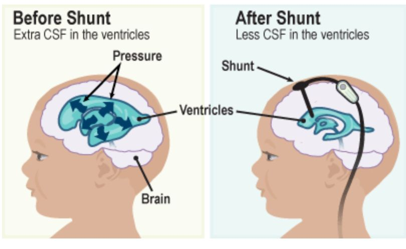
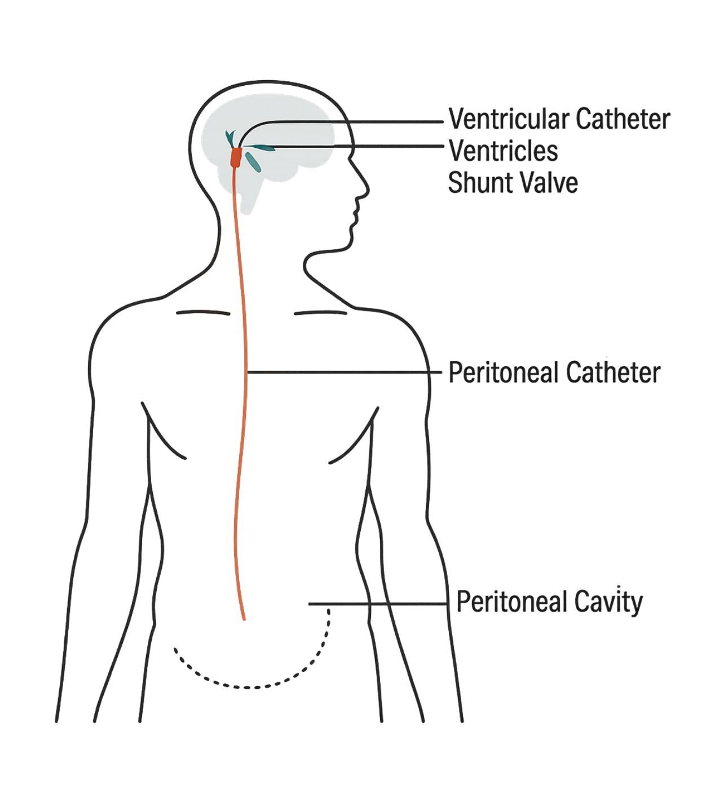

Ventriculo-Peritoneal (VP Shunt)    img { max-width: 100%; height: auto; }

### Ventriculo - Peritoneal (VP Shunt) Revision

  
_By Janet A. Dewan, PhD CRNA, Northeastern University_

From an anesthesia standpoint, this case is similar, but usually shorter in duration than the original VP shunt insertion. The surgeon can repair or completely replace the catheter. A guide wire is utilized to reinsert a new catheter if needed.

**Causes of Shunt Malfunction:**

-   Particles or tissue may enter the shunt and block the flow of CSF
-   The shunt may become disconnected or broken, so that the CSF no longer drains into the right place
-   The child may have outgrown the shunt
-   Over-drainage: The shunt is draining more CSF than it should
-   Under-drainage: The shunt is not draining enough CSF
-   Shunt infection

  

**Pre-op  
**Many of these patients may have symptoms related to elevated ICP - from a terrible headache to altered LOC.  
  
The patients may take anticonvulsant medications or steroids, which might influence anesthetic care, and generally should be continued peri-operatively. If the patient has had an external drainage device inserted at the bedside the height of the drainage bag should not be altered in transport or during induction.

ICP may be elevated or it may be normal. Even in the face of resting normal ICP hydrocephalus may decreases the autoregulatory ability to adjust to any volume change (increased CO2, position change, cough, etc) that can further increase ICP. Minimizing increases in ICP should be the cornerstone of care. Although this generally means avoiding sedation, for an agitated child it might be needed. The anesthetist should be in attendance and available to monitor if any sedation is used.

Pathophysiology can include intra-cerebral bleed, congenital CSF blockage, or intracranial tumors. Check for baseline neuro function, underlying co-morbidities and acute issues such as hyperventilation in response to ICP increase, bulging fontanelles, and the effect of head circumference on positioning for airway management. If the child is being maintained in a head up position, this should be continued until ventilation is controlled. Pre-op electrolytes and CBC are generally available and need to be checked. Pre-incision prophylactic antibiotic is indicated.

**Anesthetic:** General/ETT with the patient’s head slightly elevated.

**Muscle Relaxant:** Be careful, many of these cases may be quick.

**Position:** Supine, arms to the side, head turned to the left, the contralateral side of the shunt insertion. Sometimes a shoulder roll will be used. Aggressive neck flexion may cause the ETT to migrate into the right main-stem. Watch peak pressures and SaO2. Make sure that the ventilator tubing, IV tubing and other cords are out of the way on the patient’s left.

**EKG leads:** place leads on the patient’s back; the right anterior surface is prepped (shunt is usually on the right side).

**Bed Position:** Bed is usually rotated 90 degrees

**Duration:** 30-90 minutes.

**EBL:** minimal

**IV Access:** 20G is acceptable

**Fluid warmer:** It is suggested, but most of us don’t use one. A large portion of the patient is exposed, making the patient prone to hypothermia.

**Warming Blanket:** Lower body or underbody, depending on the patient’s age and size.

**A-line:** No

**Ventilation:** Mild hyperventilation if an elevated ICP is involved.

**Other suggested meds:** Ofirmev and anti-emetics.

**Fluid warmer:** It is suggested, but most of us don’t use one. A large portion of the patient is exposed, making the patient prone to hypothermia.

**Warming Blanket:** Lower body or underbody, depending on the patient’s age and size.

**Hydration:** 4:2:1  
(Avoid hypotonic solutions) Lactated ringers at maintenance infusion rate, adjusted for fasting, any blood loss and fluid loss from vomiting. For neonates, addition of a glucose solution can be considered, but is not the norm, unless there is a history of hypoglycemia.  
**(below are common references)**  
Albumin dose for mild hypotension: 10cc/kg is recommended (<10kg wt)  
Albumin-more effective with its oncotic pull than crystalloids (<10kg wt)  
Crystalloid Bolus dose for mild hypotension: 5-10cc/kg (<10kg wt)  
Crystalloid Bolus dose for mild hypotension: 20cc/kg (>10kg wt)  
Crystalloid Bolus (emergency) for severe hypotension (20-50cc)

**Replacement of Insensible Fluid Loss (reference)**  
Minimally invasive (inguinal, laparoscopic) 0-2 cc/kg/hr  
Mildly invasive (ureteral reimplantation) 2-4 cc/kg/hr  
Moderately invasive (simple bowel cases) 4-8 cc/kg/hr  
Significantly invasive (NEC) >10 cc/kg/hr  
**3rd Spacing:** 10mL/kg/h is standard for 3rd space fluid loss  
with an open belly case.

**EBV (reference)  
Premature:** 90-100cc/kg**Newborn:** 80-90cc/kg**3mo - 1 year:** 70-80cc/kg**1 - 4 years:** 70cc/kg  
**Adult:** 55-60cc/kg

**Emergence:** Reverse non-depolarizing blockers if indicated. Either deep extubation, if you are confident of you ability to manage the airway, or the patient is wide awake and calm. IV lidocaine at 1 mg/kg may help to suppress coughing. ICP should be less of a concern post functioning shunt, but these children may still have neuropathology that merits avoiding any maneuvers that may increase ICP, or cause excessive CSF loss (deep sedation, coughing, agitation, head down, etc.

**Possible Complications**  

-   Head bleed
-   Brain swelling
-   Bowel perforation
-   Leakage of CSF fluid under the skin
-   Infection of the shunt or brain
-   Damage to brain tissue
-   Seizures
-   The shunt may malfunction, thus requiring a surgical repair

**Signs of a shunt malfunction (CSF build-up):**  
**Newborn or Infant:**

-   Poor feeding
-   Vomiting
-   Failure to thrive; lethargic.
-   Bulging fontanelles on the top of the head.
-   Irritable
-   Seizures
-   Very noticeable scalp veins.
-   ‘Sunset’ eyes: the eyes appear to always look down and are not able to look up.
-   A fluid leaking from the incision site.

**VP Shunt malfunction signs for an older child:**

-   Headaches
-   Nausea and vomiting.
-   Tiredness
-   Irritable
-   Changes in personality, behavior, or school performance.
-   Seizures
-   Changes in vision
-   Loss of coordination
-   Fluid leaking from the incision site.

**Quick Basic Drug References  
****Propofol:** 2.5-3.5mg/kg IV  
**Succinylcholine:** <1 year: 3.0mg/kg  
\>1 year: 1.0-2.0mg/kg  
IM: 4-6mg/kg  
**Rocuronium:** <1 year: 0.25-0.5mg/kg  
1 year: 0.5-1.2mg/kg  
\>1 year: 0.5-1.3mg/kg  
**Vecuronium:** <1 year: 0.05-0.1mg/kg  
\>1 year: 0.1mg/kg  
**Neostigmine:** 0.05-0.07mg/kg  
**Robinul:** 0.01mg/kg  
**Fentanyl:** 1-2mcg/kg  
**Morphine:** 0.05-0.15 mg/kg/dose IV q2-4h prn**Ofirmev:** \>2 years: 15mg/kg  
**Not FDA approved for < 2 years, but many still administer at 15mg/kg  
Toradol:** \>2 years: 0.5mg/kg  
**Precedex** (Emergence)**:** Slow push 0.5mcg/kg  
**Zofran:** 100mcg/kg (max 4mg)  
**Decadron:** 0.2-0.5mg/kg  
**Ancef:** 25mg/kg Q6h  
**Ampicillin:** 25-100mg/kg (max per day 100-400mg/kg)  
**Gentamycin:** 2-2.5 mg/kg/dose q8h (Max dose 80 mg)  
**Ceftriaxone (rocephin):** 50-75mg/kg  
**Clindamycin (cleocin):** 15-25mg/kg  
**Invanz** (ertapenem): (3 month -12 years): 15mg/kg  
**Vancomycin:** 10mg/kg slow IV

**More Notes**  
**My advice: _This case may be urgent but is not an emergency_.** Do communicate with the surgeon so you can make your plan and share concerns. Don't lose site of the pathology and keep the child calm.  
  
I always start a pre-op IV, and it might only be a 22g. If that means delaying start till EMLA has effect I make them wait.  
  
I monitor these kids in preoperatively.  
  
The saphenous vein can be the best choice for IV, an awake child can't see what I am doing, and distraction works well if a colleague or parent engages them. The IV can be changed intra op if the kid is ambulatory or larger access is desired.  
  
For babies, I usually intubate with only propofol, 3mg/kg, but older kids get cisatracurium or rocuronium. I usually don't wait for muscle relaxant peak effect to intubate. My goal is to gain airway control as quickly as possible. Be sure you have given enough meds and the timing is right, to blunt coughing on the ETT.

During maintenance remember **_you generally get in the most trouble with_** _**light anesthesia in peds**_. Ask the surgeon to give you a 5-minute warning before tunneling so you can deepen the anesthetic. Generally there is little post-op pain with surgical local infiltration. IV acetaminophen (or acetaminophen suppository) is appropriate as the only analgesic.  
  
Small doses of narcotics may be used judiciously in PACU. I generally give ondansetron 0.15 mg/kg prophylactically.

**References:**  
Jaffe, Richard A. _Anesthesiologist's Manual of Surgical Procedures_. N.p.: n.p., 2012  
Macksey, Lynn Fitzgerald. _Surgical Procedures and Anesthetic Implications: A Handbook for Nurse Anesthesia Practice_. Sudbury, MA: Jones & Bartlett Learning, 2012.  
Nienaber, J. "Anaesthesia for Ventriculoperitoneal Shunts." _South African Journal of Anaesthesia and Analgesia_ (2012).