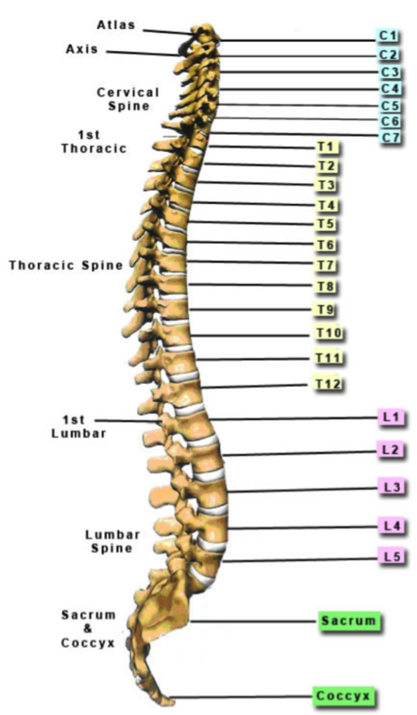
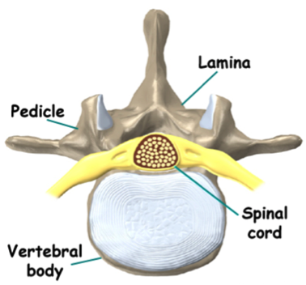
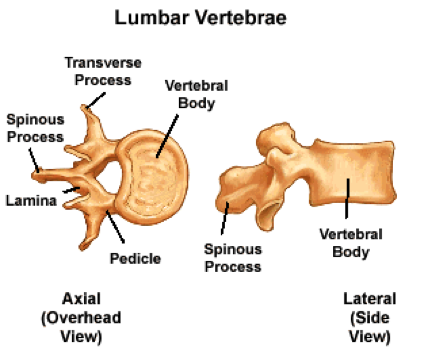
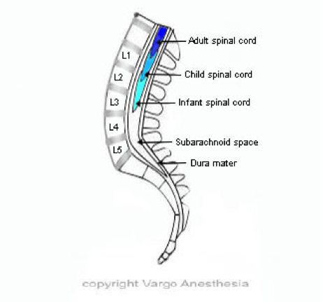

Vertebrae Anatomy and Images    body {font-family: 'Open Sans', sans-serif;}

### Vertebrae Anatomy and Images

**The vertebral column can be divided into five sections:**

1.  Cervical
2.  Thoracic
3.  Lumbar
4.  Sacral
5.  Coccygeal

**33 Vertebrae**

-   7 cervical
-   12 thoracic
-   5 lumbar
-   5 Sacral
-   4 coccygeal

  

****

  
In OB, the relevant anatomy is that of the lumbar spine where epidural and spinal anesthetics are administered.  

****

  

****

  
**Lumbar Vertebrae  
**These are the ‘fattest’ of the vertebrae due to the large body of each vertebra.  
The lumbar spine is made up of 5 vertebrae (abbreviated L1 to L5). The normal curvature is ‘inwards’ (lordosis) and is known as the lower back or abdominal back bones.  
  
In adults, the spinal cord is shorter than the vertebral column and only extends from the foramen magnum to L1. However, it is documented that the spinal column can sometimes extend down to the upper portion of L3.  
  
For this reason, the L2-L3 intervertebral space (IVS) is avoided in order to avoid mechanical trauma to the spinal cord.  

****

  
  

**Gray's Anatomy for Students  
**By Richard Drake, A. Wayne Vogl, Adam W. M. Mitchell  
  
Chestnut, David.(2014) Chestnut’s Obstetric Anesthesia Principles and Practice.  
  
Santos, Alan., Epstein, Jonathan.,(2015) Chaudhuri, Kallol Obstetric Anesthesia ; 2015.  
  
Anatomy of Human Spine  
(Mayfield Brain and Spine)  
http://www.mayfieldclinic.com/PE-AnatSpine.htm  
  
Spinal Cord Anatomy, Structure and Tracts (Ken Hub)  
https://www.kenhub.com/en/library/anatomy/the-spinal-cord