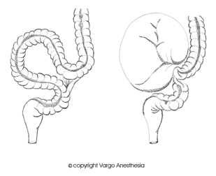

Volvulus and Malrotation Review   

## Volvulus and Malrotation Review

****

**Simply Explained:  
**The term “volvulus” is related to, but not precisely synonymous with malrotation.  
Intestinal malrotation could be present without a volvulus.

Intestinal malrotation is considered life threatening when it occurs with a volvulus and/or when there is less or a lack of perfusion to the bowel.

**Malrotation:** intestinal twisting and may cause obstruction.  
**Volvulus:** intestinal malrotation cuts off the blood supply, which may result in ischemia to the affected bowel. Emergency surgery is required to untwist the intestine to permit restoration of blood flow. The mesentery is also widened to prevent recurrence of the volvulus.  
**Mid-gut volvulus:** volvulus involves the entire small bowel; can potentially be fatal.

**Origin of Intestinal Malrotation  
**Intestinal malrotation occurs during the first trimester, usually around the tenth week of gestation. During development, the intestines temporarily migrate back into the abdominal cavity at the base of the umbilical cord. As the intestine returns to the abdomen, it makes two rotations when moving into its normal position. If this rotation is incomplete and intestinal fixation does not occur, this may create a twisting defect (intestinal malrotation).  
With intestinal malrotation, the large intestine is located to the left of the abdomen, while the small intestine is on the right of the abdomen. The cecum and the appendix, which are normally attached to the right lower abdominal wall, are unattached and located in the upper abdomen.

**Ladd Bands (Bands of Ladd)**

Normally the cecum and the appendix are attached to the right lower abdominal wall by tissue bands. With malrotation, abnormal bands (Ladd Bands) may be situated in such a position that compress the 2nd or 3rd part of the duodenum.

**Ladd’s Procedure** **:** This is the gold standard of treatment for intestinal malrotation.  
The procedure involves excision of the Ladd Bands so that the mesentery can be released allowing the intestines to relax unrestrained and unobstructed.  
Unfortunately, the bowel will remain in the backwards position permanently in turn making it more difficult to diagnose appendicitis later in life.  
Due to this intestinal malrotation, the surgeon will usually perform an appendectomy at this time.

The procedure is named after Dr. William Ladd (1880-1967).

**Volvulus and Mid-Gut Volvulus Notes  
**Secondary to intestinal malrotation and more common in infants and children, but can occur in all ages. With malrotation, the blood supply to the intestine is channeled through a very narrow mesentery that is easily obstructed.  
Since the intestine is not properly fixated, the bowel may twist its own blood supply resulting in a volvulus. The ischemia begins with venous congestion, which progresses to arterial occlusion and ultimately intestinal ischemia. This intestinal ischemia may lead to bowel strangulation, peritonitis, bloody stools, hypovolemic shock, and death.

**Mid-Gut Volvulus**  
When volvulus involves the entire small bowel.

**Surgery For Volvulus**

When a volvulus is present, the surgeon’s wants to gain immediate access to the abdomen to untwist the intestine by rotating the bowel counterclockwise.

After the volvulus is immediately reduced, the intestines are closely observed for several minutes to verify bowel viability.  
If the bowel does not regain some normality before the end of the procedure (i.e., color change to indicate improved blood flow), the surgeon will resect the necrotic portions. **Diagnosis:**  
An Upper GI Series (UGI) to assess an abnormally positioned intestine.  
Identifying the position of the ligament of Treitz (a band of tissue that anchors the last part of the duodenum to the retroperitoneum). Any abnormal positioning of this portion of intestine should be considered malrotation.

**Diagnosis  
**Plain x-rays, ultrasounds, and CT scans are not as reliable as a UGI series because the UGI uses contrast media that illuminates on the scan. The contrast either stops flowing or only moves through a thin opening.

**Intestinal Malrotation Facts**

1 out of every 500 births in the United States.

The exact reason this occurs is unknown.  
Gender: Male = Female  
60% present in the first month of life  
20% present between 1 month and 1 year of age  
20% after 1 year.

Many patients remain asymptomatic and may be accidentally diagnosed later in life by surgery or a CT Scan.

**Associated with other congenital anomalies:** Usually but not always (see list below)  
When associated with a volvulus, the anomaly is usually the patient’s only disorder.

**Possible Pre-op Symptoms:**  
Bilious or bloody vomiting  
Hemodynamic instability due to sepsis  
Tender and distended abdomen due to episodes of intermittent duodenal obstruction caused by intestinal bands.  
Dehydration - usually resolved with IV hydration.  
Rectal bleeding - a sign that the bowel has been compromised and may indicate that the infant has a gangrenous bowel.

**Other congenital abnormalities  
**Up to 62% of malrotation are associated with abnormalities.  
Polysplenia  
Asplenia  
Abdominal wall defects  
Duodenal Atresia  
Meckel Diverticulum  
Intussusception  
Small bowel atresia  
Prune Belly Syndrome  
Gastric Volvulus  
Persistent cloaca  
Hirschsprung disaese  
Extrahepatic biliary anomalies  
Dextroisomerism  
  
Serious anomalies may increase the risk of mortality 22x. Physicians treating pediatric patients with malrotation must be aware of the possibility of other associated congenital abnormalities.

Liacouras C, Piccoli D. Gastroenterology: Requisites (Requisites in Pediatrics); 2007  
  
**Intestinal Malrotation and Volvulus**  
Cincinnatichildrens.org/health/i/intestinal-malrotation  
Renee Ingoe, RN; Patricia Lange, MD  
**The Ladd’s Procedure for Correction of Intestinal Malrotation With Volvulus in Children  
**AORN JOURNAL • FEBRUARY 2007, VOL 85, NO 2  
usually are edematous and congested, and some areas may even appear necrot- ic.4 The