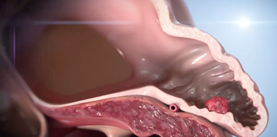
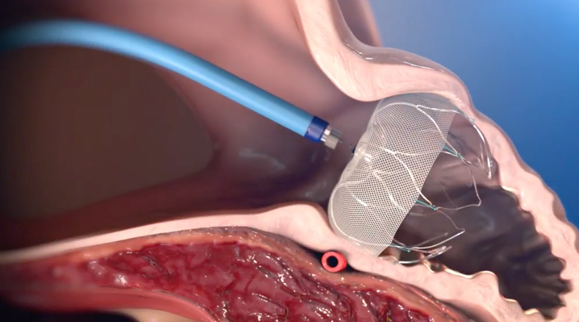
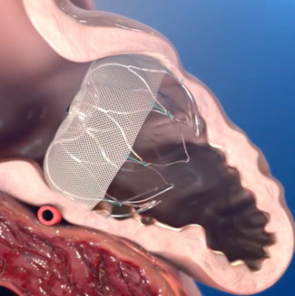

Watchman Procedure (LAACD)    body {font-family: 'Open Sans', sans-serif;}

### Watchman Procedure (LAACD)

**LAA:**  
\- A pouch-like extension located on the top of the left atrium.  
\- It is about the size of your thumb, with a narrow opening into the left atrium.  
\- Like the appendix, The LAA doesn’t have a clear role in your body.  
\- During atrial fibrillation, blood flow through the left atrium becomes turbulent.  
\- Lack of an effective contraction also allows more blood to remain in the atrium.  
\- Blood may pool into the LAA, which becomes prone to clotting.  
\- The clots may easily dislodge into circulation and cause a stroke.

****

  
\- It is well known that patients with chronic A-Fib have an increased risk of stroke.  
\- Atrial fibrillation is the leading cardiac cause of stroke.  
\- Almost one-half of patients with nonvalvular atrial fibrillation are treated with anticoagulation to reduce the risk of strokes.  
\- For various reasons, many patients are unable to take anticoagulants on a long-term basis.  
\- Several left atrial appendage occlusion devices have been proposed as alternative approaches to minimize the risk of thromboembolic events.  
\- The Watchman™ Left Arial Appendage Closure Device (LAACD) is one of them.  
  
**Indications:**  
\- The goal of the Watchman procedure is to close off the LAA permanently, reducing the risk of thromboembolism from the LAA in patients with non-valvular A-fib who are at increased risk for stroke and systemic embolism and are recommended anticoagulation therapy.  
\- Over time, patients may be able to stop taking anticoagulants.  
  
**Contraindications:  
**Intracardiac thrombus is visualized by echocardiographic imaging.  
  
**A patient has a history of:**  
Atria septic repair or closure device.  
Patent foreman ovale or closure device.  
Incompatible LAA anatomy.  
  
**The Watchman procedure:**  
\- The procedure is performed in a cath lab using fluoroscopy and transesophageal echo (TEE).  
\- The procedure is conducted by a team of physicians, which includes interventional cardiologists/electrophysiologists and physicians with special expertise in echocardiographic imaging.  
\- After the patient is intubated and the airway is secured, the anesthesia provider inserts a TEE probe for the physicians.  
\- The cardiac physician inserts a guidewire and vessel dilator into the patient’s femoral vein and guides it into the right atrium under fluoroscopy.  
\- Using a standard transseptal access system, the inter-atrial septum is crossed into the left atrium by the Watchman Access Sheath and Dilator.  
\- The Watchman Delivery System is prepped, inserted into the access sheath, and slowly advanced under fluoroscopic guidance. The Watchman device is then deployed into the LAA.

****

****

\- The patient usually stays in the hospital overnight.  
\- The device gradually endothelializes and permanently seals off the LAA.  
\- The seal is later confirmed by TEE.  
  
\- Following the procedure, the patient takes warfarin and aspirin for at least 45 days or until the LAA is adequately sealed. After that, the patient will take Plavix and aspirin for a few months, followed by ongoing aspirin therapy.  
  
**Note:** Today, anesthesia is rarely requested anymore for these procedures.  
  
**Anesthesia:** Local without anesthesia or general/ETT  
**Muscle relaxation:** Not needed.  
**Narcotics:** Not needed.  
**Duration:** About 1 hour  
**Arterial line:** Optional  
**Heparin, protamine, and ACT monitoring:**  Yes  
**Position:** Supine and arms to the side.  
**IV access:** Usually one.  
**EBL:** Minimal  
  
**Possible complications (very rare):**  
Device embolization  
Device dislodgement or migration dislodgement or embolization  
Cardiac perforation  
Traumatic damage to adjacent structures, including the pulmonary artery, left pulmonary veins, and the circumflex coronary artery, is possible.  
Air embolization  
Thrombus formation  
Serious pericardial effusion  
Procedural stroke  
Right leg deep vein thrombosis  
Perforation of right femoral artery  
ST-segment elevation  

Watchman The One-Time Procedure  
http://tinyurl.com/3yrphubp  
  
Fact Sheet:  
The WatchmanTM Left Atrial Appendage (LAA) Closure Device  
Boston Scientific  
http://tinyurl.com/3bdhp4eu  
  
Complications From Left Atrial Appendage Exclusion Devices  
Journal of Atrial Fibrillation. 2014 Jun-Jul; 7(1): 1034  
Laura Perrotta, Stefano Bordignon, Daniela Dugo, Alexander Fürnkranz,Athanasios Konstantinou, Giuseppe Ricciardi, Paolo Pieragnoli, Boris Schmidt, and KR Julian Chun  
  
Left atrial appendage exclusion for stroke prevention in patients with nonrheumatic atrial fibrillation.   
Stroke. 2007 Feb;38 (2 Suppl):624–30.  
Onalan Orhan, Crystal Eugene.  
  
Death from pulmonary artery erosion complicating implantation of percutaneous left atrial appendage occlusion device.   
Heart Rhythm. 2013 Dec;10 (12):1810–1.  
Sepahpour Ali, Ng Martin K C, Storey Philip, McGuire Mark A.  
  

****