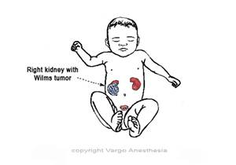

Wilms' Tumor –Notes and Facts   

### Wilms' Tumor – Notes and Facts

Named after Max Wilms, a German doctor who wrote one of the first medical articles about the disease in 1899.

Wilms' tumor (also known as nephroblastoma) is a rare cancer that starts in the kidneys and primarily affects children.

**Exact Cause** : Unknown. More common among some siblings and twins, suggesting a possible genetic cause.  
  
**The average Wilms' tumor is 1 pound at diagnosis.**

**Age range:** Occurs mostly at ages 1 to 4; less common after age 5.  
  
**Peak age diagnosed:** 1-3 years of age (usually around 3).

This is the most common childhood abdominal malignancy. About 9 of 10 kidney cancers in children are Wilms tumors.

Over 90% have a favorable histology (good cure rate).

When the tumor has not spread, there is a 90% cure rate with appropriate treatment.

The Tumor is usually encapsulated or self enclosed; the surgeon does not want leakage.

A Wilms' tumor comprises 6% of all pediatric malignancies.

Wilms' tumors are found equally in both genders. Occurs bilaterally in 5% of all cases. Hypertension occurs in 60% of all cases. HTN and kidney damage may occur as the result of the tumor or its treatment.

Von Willebrand's disease occurs in <10% of cases.  
Hematuria in 10-25% of all cases.

Relapse free survival rate at 2 years is around 90%.

Having an Overexpression of HER-2 (oncoprotein) makes a favorable prediction of survival.

The tumor is most often located in the upper or lower renal pole.

10% will involve the renal vein and 5% will extend into the vena cava to the right atrium.

There have been great improvements in the diagnosis and treatment of Wilms' tumor which have improved the prognosis. Fortunately, today in America, most tumors are found before they have spread (metastasized) to other organs.

These tumors often become large before they are even noticed. The average newly diagnosed Wilms tumor is many times larger than the kidney.

**Possible Symptoms**  
Urinary tract problems  
Swelling of one side of the body (hemihypertrophy)  
Firm, smooth lump in the child's abdomen  
Nausea and vomiting  
Loss of appetite  
Stomach pain  
Hypertension  
Hematuria  
Fever

**Initial imaging:** Ultrasound and CT Scan of the abdomen. Also, a chest CT may reveal asymptomatic pulmonary metastases that may or may not be apparent on a baseline chest X ray.

**Preoperative Chemotherapy:** Chemotherapy sometimes precedes the surgical resection, which may add more anesthetic issues. Chemotherapy may affect hepatic, coagulation, and cardiac function.

**Treatment**  
The first step: **Staging the tumor.**  
Staging, combined with histological information from primary resection or biopsy, determines the best treatment.

**Surgery:** Remove the tumor ASAP. Surrounding lymph nodes and organs may also need to be removed if the tumor has spread.

**Wilms Tumors Histology - 2 types**  
  
**Unfavorable: Anaplasia-** The highly variable cancer cell composition with the cells' nuclei being very large and distorted. The more anaplasia a tumor has, the harder it is to cure.

**Favorable histology:** **No anaplasia.** The cancer cells still appear abnormal, but there is no anaplasia. More than 9 of 10 Wilms tumors have a favorable histology. The chance of a cure for children with these tumors is very good.

**Associated Anomalies**  
Aniridia 1% (absence of an iris)  
Hemihypertrophy 2% (swelling of one side of the body)  
Neurofibromatosis (tumor growth on the nervous system)  
Beckwith-Wiedemann syndrome (the patient can have abnormally large tongue or macroglossia, among other issues)

**Many Genitourinary Issues**  
Horseshoe-shaped kidney  
Cryptorchidism (undescended testicle)  
Gonadal dysgenesis  
Hypospadias  
Duplication of collecting systems

**Metastatic** Lymph nodes, lung, liver, brain

**Wilms' Tumor Staging**

**Stage I** - Tumor confined to kidney and completely resected. No capsular spillage.

**Stage II** \- Tumor extending beyond the kidneys, but completely excised with no lymph node involvement. The encapsulated tumor was breached with local spillage during resection.

**Stage III** - Residual Nonhematogenous spread beyond the kidney (confined to the abdomen, abdominal lymph nodes, transected renal vein or inferior vena cava tumor thrombus) with peritoneal surface spillage during resection.

**Stage IV** - Hematogenous metastases or extra-abdominal lymph node spread.

**Stage V** - Bilateral renal involvement at diagnosis.

Anderson PM, Dhamne CA, Huff V. Neoplasms of the kidney. In: Kliegman RM, Behrman RE, Jenson HB, Stanton BF, eds. Nelson Textbook of Pediatrics. 19th ed. Philadelphia, PA: Elsevier Saunders; 2011:chap 493.

Peter J. Davis (Author), Franklyn P. Cladis (Author), Etsuro K. Motoyama Smith's Anesthesia for Infants and Children, 8th Edition; March 16, 2011