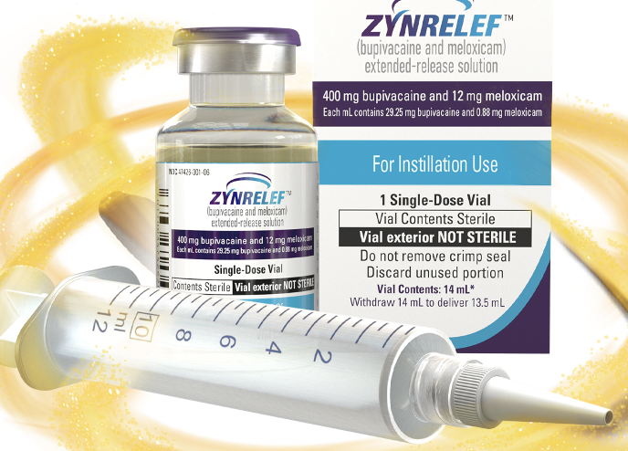

ZYNRELEF (DALA), ZYNRELEF/meloxicam    body {font-family: 'Open Sans', sans-serif;}

### ZYNRELEF (DALA), ZYNRELEF/meloxicam

Combined bupivacaine with a low dose of meloxicam for a synergistic analgesic effect.  
It is viscous and needleless.  
It is applied into the surgical site following final irrigation and suction and before suturing.**  
It is not used by anesthesia providers for regional blocks.**

****

**  
  
Facts:  
**\- A low dose of meloxicam added to bupivacaine results in a synergistic analgesic effect.  
\- It is the only local anesthetic considered by the FDA to be extended-release, based on superiority to bupivacaine through 72 hours.  
\- It has more contraindications and warnings due to the addition of the NSAID meloxicam.  
**\- A study showed that** **39%** of TKA patients treated with ZYNRELEF and a non-opioid MMA regimen received no opioid discharge prescription and had no callbacks through day 11 of recovery.  
  
**ZYNRELEF should** **NOT be administered via the following routes.  
**\- Epidural\- Intrathecal\- Intravascular\- Intra-articular\- Regional nerve blocks\- Pre-incisional or pre-procedural locoregional anesthetic techniques.  
  
**Warnings and risks: Cardiovascular and GI events  
**\- Nonsteroidal anti-inflammatory drugs (NSAIDs) cause an increased risk of serious cardiovascular thrombotic events, including myocardial infarction and stroke, which can be fatal. This risk may occur early in treatment and may increase with duration of use.  
ZYNRELEF is contraindicated in the setting of coronary artery bypass graft (CABG) surgery.  
  
\- NSAIDs cause an increased risk of serious gastrointestinal (GI) adverse events, including bleeding, ulceration, and perforation of the stomach or intestines, which can be fatal.  
\- These events can occur at any time during use and without warning symptoms.  
\- Elderly patients and patients with a prior history of peptic ulcer disease and/or GI bleeding are at greater risk for serious GI events.  

Zynrelef  
Accessed 07/2024  
https://zynrelef.com/dosing-administration