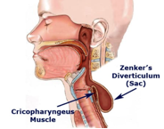
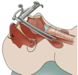
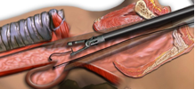

Zenker's Diverticulectomy (Transoral)    body {font-family: 'Open Sans', sans-serif;}

### Zenker's Diverticulectomy (Transoral)

**ZD is also referred as:**  
Cricopharyngeal diverticulum   
Pharyngoesophageal diverticulum  
Hypopharyngeal diverticulum  
Pharyngeal pouch  
  
Diverticulum refers to an abnormal, pouch-like structure.  
Diverticula can form in nearly all areas of the digestive tract.  
Esophageal diverticula are abnormal pouches that arise from the wall of the esophagus.  
ZD is an outpouching of esophageal tissue through the Killian triangle and typically extends posteriorly in the hypopharynx directly proximal to the upper esophageal sphincter.  
ZD typically extends posteriorly in the hypopharynx directly proximal to the upper esophageal sphincter (UES) and is the most common type of esophageal diverticulum.  

****

  
**Clinical presentation  
**Dysphagia: 80%  
Regurgitation: 50%  
Documented reflux: 44%  
Pulmonary infection: 37%  
Weight loss: 23%  
Globus sensation: 21%  
Choking: 20%  
Coughing: 18%  
  
**Other**  
Esophageal spasm  
Esophagogastroduodenal ulceration  
Retrosternal pain  
Hiatal hernia  
Halitosis  
Sensation of a lump in their throat  
Noisy deglutition  
  
**Surgical Options**  
Diverticulectomy alone  
Myotomy alone  
Diverticulectomy with myotomy  
Diverticulopexy with myotomy  
Transoral stapling  
  
**Open Surgery:** Transcervical Surgical Approach (open neck incision).The diverticulum is exposed through a lateral neck incision, and the pouch may be resected.  
  
**Endoscopic Staple Diverticulotomy  
Minimally invasive:** Transoral stapling (most popular)  
Involves a Transoral rigid instrument (diverticuloscope) and performed primarily by otorhinolaryngologists.  
One blade is placed in the ZD and the other in the cervical esophagus.  
The common wall separating the diverticulum from the esophagus is reduced with an endoscopic stapler.  

****

****

  
Surgical endoscopists and gastroenterologists use flexible endoscopes to perform transoral therapy.  
  
**Anesthesia and perioperative management and concerns  
**Avoid oral premedications.  
Antacids or dihydrogen blockers have no value because the contents in the pouch have an alkaline pH.  
Thus, if aspiration of the contents of a ZD occurs, it should not lead to acid-related complications.  
Preoperative fasting does not guarantee an empty pouch.  
Avoid insertion of an NG/OG tube; it may cause perforation of the diverticulum.  
Emptying the diverticulum preoperatively via manual external pressure is suggested, but rarely performed.  
ZD is formed by striated muscles and is relaxed and incompetent after the induction of anesthesia.  
**Avoid cricoid pressure with RSI:** Cricoid pressure: only recommended if the neck of the pouch is under the cricoid cartilage.  
With ZK, the neck of the pouch is always above, and cricoid pressure may increase the risk of regurgitation and aspiration.  
However, documentation indicates that numerous anesthesia providers have applied cricoid pressure safely without aspiration.  
The surgeon may insert a moist gauze pack to surround the ETT prevent aspiration during surgery.  
  
**Anesthesia for the minimally invasive repair of ZD  
Anesthesia:** General/oral ETT should be fixed to the left side of the patient’s mouth.  
Deep cervical plexus blockade can be an optional since the patients remain awake and responsive (rarely performed)  
**Induction:** RSI with a 30° head-up tilt WITHOUT the use of cricoid pressure is recommended to avoid regurgitation from the pouch.  
**Muscle relaxation:** Yes  
**Positioning:** Supine, arms tucked, or to the side, bed rotated 90 degrees and shoulder roll to hyperextend the neck.  
A small pillow is placed for back support, and the neck is hyperextended.  
The surgeon sits behind the patient’s head.  
  
**EBL:** Minimal  
**Duration:** 30-90 minutes  
**Possible complications of open surgery**Mean complication rate: 8% w/ Mediastinitis: 2%  
Recurrent laryngeal nerve injury: 3%  
Leak or perforation: 3%  
Cervical infection: 2%.Mediastinitis: 2%  
  

Zenker's Diverticulum  
Clinical Gastroenterology and Hepatology. Volume 12, Issue 11, Pages 1773–1782  
Ryan Law, David A. Katzka, Todd H. Baron, and Todd H. Baron  
  
Endoscopic transoral stapling of Zenker’s diverticula.  
MULTI-MADIAN MANNUAL of Cardio-thoracic Surgery (accessed 02/2020)  
  
Aspiration Pneumonia after Anesthesia in a Patient with a Zenker Diverticulum  
Anesthesiology; 2000; 92(6):1837  
Marie T. Aouad, M.D.; Carina E Berzina.; Anis Baraka MD  
What Is Zenker’s Diverticulum and How Is It Treated?  
Healthline (accessed 02/2020)  
https://www.healthline.com/health/zenkers-diverticulum  
  
Zenker’s Diverticulum  
MULTI-MADIAN MANNUAL of Cardio-thoracic Surgery (accessed 02/2020)  
https://mmcts.org/tutorial/670  
  
Transoral flexible endoscopic therapy of Zenker's diverticulum: is it time for gastroenterologists to stick their necks out?.  
Gastrointest inalEndoscopy. 2013; 77: 708–710  
Katzka, D.A. and Baron, T.H.   
  
Esophageal Diverticula  
AMBOSS Medical Notes (accessed 02/2020)  
https://next.amboss.com/us/article/Eg08C2#Z96fed3be03764df79520be6a80143922