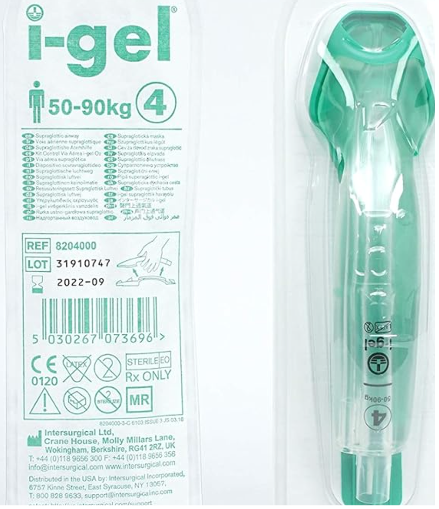

i-Gel LMA    body {font-family: 'Open Sans', sans-serif;}

### i-Gel LMA

**Manufacturer:** INTERSURGICAL, INC.  
The i-gel supraglottic airway is the most popular LMA among anesthesia providers and pulmonologists as an airway conduit for bronchoscopies when avoiding ETTs.

****

**Facts:**  
Second generation LMA  
Non-inflatable (just open and insert)  
It offers an anatomical seal of the pharyngeal, laryngeal and perilaryngeal structures while avoiding compression trauma.  
  
**The following sizes:** 1, 1.5, 2, 2.5, 3, 4 and 5.  
**Note:** The size 1 neonatal i-gel does not have this gastric channel.  
  
**Positive features:  
**\- **Made from a thermoplastic elastomer:** PVC and latex-free.  
**\- Thermoplastic softens** when heated and hardens when cooled, potentially helping seal the device at body temperature.  
\- 15 mm connector – reliable connection to any standard catheter mount or connection  
\- Displayed product information – Quick reference for size and weight guidance  
**\- Position guide:** Confirmation of optimum insertion depth  
**\- Gastric channel:**  Allows for suctioning and passing of a nasogastric tube  
\- **Integral bite block:** Reduces the possibility of airway channel occlusion  
**\- Buccal cavity stabilizer:** Aids insertion and eliminates the potential for rotation  
\- **Epiglottis blocker:**  Reduces the possibility of epiglottis ‘down folding’ and airway obstruction  
  
**Gastric channel:  
**\- The i-gel accommodates the following size suction catheters through the gastric channel:  
Sizes 2- 4\- It can take a 12 Fr suction or nasogastric tube  
\- A #5 i-gel can accommodate a 14 Fr catheter.\- You will need a lubricating gel to advance a suction tube through the gastric channel.  

i-gel® Supraglottic Airways  
Boundtree (accessed 02/2024)  
https://tinyurl.com/5a7a5dzr  
  
Airway Equipment  
Anesthesia Airway Management (accessed 02/2024)  
UCSF  
https://aam.ucsf.edu/airway-equipment  
  
i-gel™ supraglottic airway in clinical practice: a prospective observational multicentre study  
British Journal of Anaesthesiology, 2012 Dec;109(6):990-5.  
L Theiler 1 , M Gutzmann, M Kleine-Brueggeney, N Urwyler, B Kaempfen, R Greif  
  
The supraglottic airway I-gel in comparison with ProSeal laryngeal mask airway and classic laryngeal mask airway in anaesthetized patients  
European Journal of Anaesthesiology 2010 Jul;27(7):598-601.  
Won-Jung Shin 1 , Yu-Seon Cheong, Hong-Seuk Yang, Tomoki Nishiyama