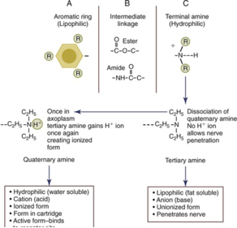
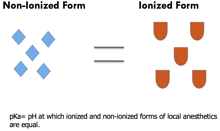
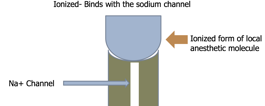

Local Anesthetics and pKa Made Simple    body {font-family: 'Open Sans', sans-serif;}

### Local Anesthetics and pKa Made Simple

_(please read “Local Anesthetic Structure and Notes” first)_

**What is the state of a local anesthetic in a glass vial?  
**The local anesthetic in the glass vial exists in two forms-ionized (charged-cationic) and non-ionized-not charged. The greatest proportion is ionized. Local anesthetics exist as weak bases. To make them stable they are manufactured as hydrochloric salts. Thus they are stored in an acidic environment.  
  
Non-ionized = lipid soluble  
Ionized = water soluble  
  
**Non-ionized                          Ionized**

****

  

****

  
When an acidotic (i.e. manufactured) local anesthetic is injected in the tissue (tissue having a pH of 7.4), the ionized and non-ionized portions equilibrate. Since tissue pH is higher than the solution pH, more of the local anesthetic will become non-ionized (lose its charged proton) to be lipid soluble (see top image).  
  
It is non-ionized portion of the local anesthetic that crosses the nerve membrane. At each phase there is an equilibration of ionized and non-ionized local anesthetic based on the pKa and pH.  
  
Once the non-ionized local anesthetic diffuses the nerve membrane, it shifts back to become ionized so it may bind with the Na channel and results in blockade.  
  
Ionized molecules do not diffuse so easily in through the nerve lipid membrane. This is why local anesthetics injected into acidotic tissue (i.e. infected tissue) rarely results in a successful block.  
  
**pKa  
**A drug’s pKa is the pH of when 50% of the drug molecules are in the non-ionized form and the other 50% are in the ionized form.

****

**Example of Lidocaine  
**The pKa of lidocaine is 7.9, which means that at a pH of 7.9, 50% of the lidocaine molecules are ionized and the other 50% is nonionized. But it is much different it physiologic pH!  
So you notice below, after lidocaine equilibrates in a tissue environment with a pH of 7.4, 25% in non-ionized (lipid soluble) and 75% ionized.  
  
**Lidocaine pKa of 7.9**

table.tableizer-table { font-size: 12px; border: 1px solid #CCC; font-family: Arial, Helvetica, sans-serif; } .tableizer-table td { padding: 4px; margin: 3px; border: 1px solid #CCC; } .tableizer-table th { background-color: #104E8B; color: #FFF; font-weight: bold; }

| pH of environment | % nonionized | % ionized |
| --- | --- | --- |
| 7.9 | 50 | 50 |
| 7.6 | 33 | 67 |
| 7.4 | 25 | 75 |
| 7.1 | 17 | 83 |

  
  
**Local Anesthetics needs to be ionized to bind to Na Channel  
**So now the local anesthetic that just diffused a nerve lipid membrane must now shift back to the left (see Henderson-Hasselbalch equation above) to become ionized (charged) in order to attach to a Na channel and block nerve conduction.  
  
**Ion trapping within the nerve  
**The newly ionized local anesthetics is trapped and unable to exit the cell, since it is now NOT lipid soluble. This is referred to as "ion-trapping." In the ionized form, the molecule binds to the local anesthetic binding site inside of the Na channel near the cytoplasmic end.  
However, there is a continual equilibration between the ionized and non-ionized form. The non-ionized form continues to “exit” the area until there is not enough ionized local anesthetic molecules to complete the blockade of impulses. Otherwise the local anesthetic blockade would last forever.

****

**Summary**  
Local anesthetic injected into the tissue of a pH of 7.4  
Ionized and non-ionized must equilibrate across different mediums. (i.e. from vial to tissue; from tissue across physiological barriers; from physiological to the site of action the NA channel.)  
  
Non-ionized to diffuse the lipid membranes: ionized to bind to Na channels and block nerve conduction.  
  
**pKa of Local Anesthetics  
**

table.tableizer-table { font-size: 12px; border: 1px solid #CCC; font-family: Arial, Helvetica, sans-serif; } .tableizer-table td { padding: 4px; margin: 3px; border: 1px solid #CCC; } .tableizer-table th { background-color: #104E8B; color: #FFF; font-weight: bold; }

| Anesthetic | Type | pKa |
| --- | --- | --- |
| Chloroprocaine | Ester | 8.7 |
| Procaine | Ester | 8.9 |
| Tetracaine | Ester | 8.6 |
| Lidocaine | Amide | 7.9 |
| Bupivacaine | Amide | 8.2 |
| Ropivacaine | Amide | 8 |
| Mepivacaine | Amide | 7.6 |
| Prilocaine | Amide | 7.9 |
| Etidocaine | Amide | 7.7 |

  
**More pKa and Facts  
**A drug’s pKa is the pH of when 50% of the drug molecules are in the non-ionized form and the other 50% are in the ionized form. Remember that local anesthetic agents are weak bases, meaning that they exist in two forms: unionized (B) and ionized (BH+). The pKa of a weak base defines the pH at which both forms exist in equal amounts. As the pH of the tissue differs from the pKa of the specific local anesthetic there will be varying ratios of the drug either in its charged or uncharged form. This is expressed in the Henderson-Hasselbalch equation: pKa – pH = log \[BH+\] / \[B\] Where \[B\] is the concentration of unionized and \[BH+\] the concentration of ionized drug. Local anesthetics have a pKa between 7.5 and 9.  
  
**The closer local anesthetic (pKa) is to the tissue pH, the more rapid the onset time because the greater the proportion that is non-ionized. (with the exception of benzocaine).  
  
**The pKa of a local anesthetic determines the ratio of ionized and non-ionized form at any given pH.  
At physiological pH (7.4) all local anesthetics are MORE IONIZED than non-ionized (for drugs with pKa values are greater than 7.4).  
  
**However the proportions vary between the drugs:**  
**Lidocaine pKa = 7.9**  
This means at a pH 7.9, 50% are ionized and other 50% are nonionized.  
But at a pH of 7.4, 75% are ionized and 25% are non-ionized.  
  
**Bupivacaine pKa = 8.1**  
This means at a pH 8.1, 50% are ionized and other 50% are non-ionized.  
  
At pH of 7.4, 85% are ionized and 15% are non-ionized. The drug that is more non-ionized at physiological pH will reach its target site more quickly than the drug that is less so. This explains why lidocaine has a faster onset of action than bupivacaine.  
  
**The higher the pKa, the slower than onset, except with Chloroprocaine**  
Let’s look at the exception3% Chloroprocaine is a local anesthetic known to have the fastest onset. It is recommended in many books to be administered for emergency (now called urgent) C-sections for the patients who have a pervious placed epidural. But 3% Chloroprocaine has a pKa of 8.7. That does not make sense. 3% Chloroprocaine (30mg/mL) is extremely concentrated compared to many other local anesthetics with slower onsets. That means it has many more molecules to diffuse compared with 0.125% or 0.0625% bupivacaine.  
  
Clinical onset is **NOT** the same for all local anesthetics with the same pKa!  
This may be due to the individual local anesthetics ability to diffuse through connective tissue.In general, when the pKa approximates the physiological pH there will be a higher concentration of non-ionized base and a faster onset.  
  
**Sodium bicarbonate can be added to a local anesthetic to hasten the onset.**  
This increases the amount of drug in the base form, which slightly shortens the onset time.  
  
**Remember:** You will a shift with the Henderson-Hasselbalch Equation)  
In an ALKALINE ENVIRONMENT, the equation will tend towards the left, i.e. the ionized form. (See image nearest top of the page).  
  
The tertiary amine (hydrophobic or water insoluble) part of the local anesthetic becomes quaternary and is thus soluble in water and suitable for injection. At physiological pH, the proportion of the drug that dissociates into a free base (which is lipid soluble) is determined by its pKa.  
It is the ratio of ionized to non-ionized local anesthetic that, in general, is responsible for the onset of action. The higher the ratio of non-ionized, the faster the local anesthetic can transverse physiological barriers to reach its site of action….the NA channel.  
  
The ionized portion of the local anesthetic blocks the sodium channels.  
  
The closer the pK of the drug is to physiological pH (7.4), the greater the amount of free base or non-ionized drug present and the faster the onset of the block.  
  
The closer local anesthetic (pKa) is to the tissue pH, the more rapid the onset time.  
  
Lidocaine has a pKa of 7.7 and has an onset time of just 5 to 15 minutes.  
  
As the pH increases, the nonionized drug increases.  
  
Sodium bicarbonate is often added to a local anesthetic to quicken the onset. This increases the amount of drug in the base form, which slightly shortens the onset time.

IFNA / International Federation of Nurse AnesthetistsDeveloping Countries Regional Anesthesia Lecture Series Daniel D. Moos CRNA, Ed.D. U.S.A.  
  
**Chestnut’s Obstetric Anesthesia Principles and Practice.**  
Chestnut, David.(2014) pp 564.  
**  
DrugBAnk**  
http://www.drugbank.ca/drugs/DB00813.  
  
**Pharmacology of local anesthetic agents.  
**Update in Anesthesia 1994; 19-24  
www.world-anaesthesia.org  
  
**Chapter 45. Pharmacology of Local Anesthetics  
**Anesthesiology. 2nd ed. New York: McGraw-Hill; 2012  
  
Heavner JE. Longnecker DE, Newman MF, Brown DL, Zapol WM, 2nd ed. New York: McGraw-Hill; 2012.  
  
**Local Anesthetics Clinical Pharmacology**  
Nysora:http://www.nysora.com/regional-anesthesia/foundations-of-ra/3492-local-anesthetics-clinical-pharmacology-and-rational-selection.html  
  
**Local Anesthetics and pH**  
AnesthesiaUK  
http://www.frca.co.uk/article.aspx?articleid=220  
  
**Local Anesthetics Pharmacology  
**AnesthesiaUK  
http://www.frca.co.uk/article.aspx?articleid=100505  
  
**Local Anes Onset (Open Anesthesia)** https://www.openanesthesia.org/aba\_local\_anes\_onset\_-\_factors\_influencing/