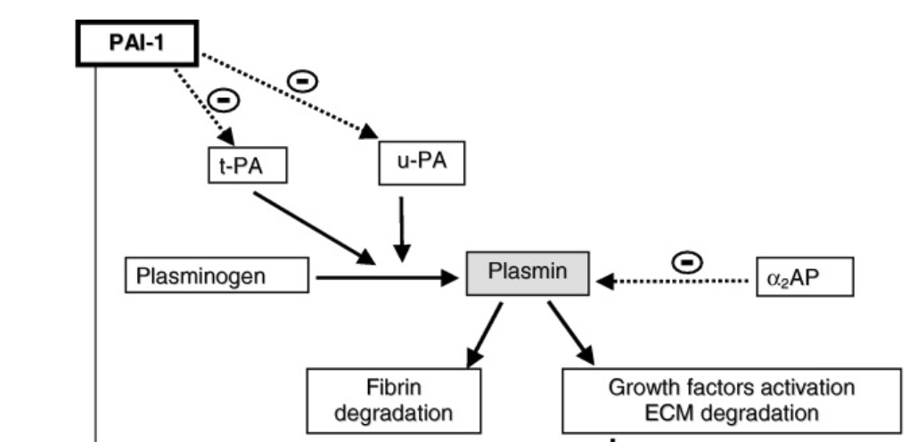

tPA and uPA    body {font-family: 'Open Sans', sans-serif;}

### tPA and uPA  
**(Tissue plasminogen activator and urokinase plasminogen activator)**

Naturally produced in the body. Activates plasminogen for fibrinolysis (breaking down blood clots).  

****

  
tPA is probably the most widely studied plasminogen activator, as well as being extensively used clinically as a synthetic therapeutic thrombolytic (Alteplase).  
  
Fibrinolysis initiated by tPA (tissue plasminogen activator) or uPA (urokinase-like plasminogen activator), converts plasminogen to plasmin in the presence of fibrin by cleaving the Arg561-Val562 peptide bond.  
  
tPA is naturally produced by endothelial cells.  
Its activation of plasminogen is the major mechanism for lysis of fibrin clots.  
Recombinant tPA is used to treat myocardial infarction, stroke and some cases of acute thrombosis.  

****

  
**Urokinase - plasminogen activator** \- uPA  
uPA is found in urine and plasma.  
Keeps renal tracts free of blood clots.  
Sometimes used for the treatment of pulmonary embolisms.  
  
Excessive fibrinolysis is prevented by plasmin inhibitor (antiplasmin, formerly called alpha2-antiplasmin) and plasminogen activator inhibitor 1 (PAI-1, inhibits tPA and uPA).  

Basic mechanisms and regulation of fibrinolysis  
Journal of Thrombosis and Haemostasis, 13 (Suppl. 1): S98–S105  
C. LONGSTAFF and K. KOLEV  
  
Coagulation-General Fibrinolysis pathway  
By Jeremy Parsons, M.D, 2016.  
http://www.pathologyoutlines.com/topic/coagulationfibrinolysis.html