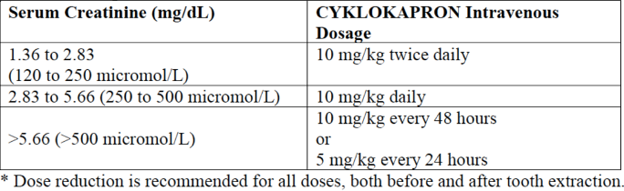

Tranexamic Acid   body {font-family: 'Open Sans', sans-serif;} .ui-header .ui-title, .ui-footer .ui-title { margin-right: 0 !important; margin-left: 0 !important; } \* { margin:0px; padding:0px;} .ui-page { background: #f2f2f2 url(bg.jpg); line-height:1.5em;} #home\_link { color:#FFF; text-decoration:none; cursor:pointer; font-family:'AndikaBasicRegular',Arial, sans-serif; font-size:0.9em; margin-left:15%; } #home\_link span {font-size:0.6em;margin-left:15%; color: #D8D8D8; } h1 {font-family:'AndikaBasicRegular'; }

# Tranexamic Acid

  
**Tranexamic Acid (Lysteda, Cyklokapron)**  
Similar drug to Amicar.  
**Class:** Anti-fibrinolytic, antihemorrhagic.  
**Indications:** To treat or prevent excessive blood loss during surgery.  
I have only used this drug in orthopedics for backs and knees. Just follow the surgeon's protocol.  
  
**Orthopedic Protocol:**  
20mg/kg IV  
For a Total Hip-give after induction  
For a Total Knee-give right before they start to cement.  
  
**Other Doses:**  
Usually 1 gram  
Short-term management of hemorrhage  
**Adult:** 0.5-1 g or 10 mg/kg tid or 25-50 mg/kg daily by continuous infusion.  
**Child:** 10 mg/kg bid or tid.  
10 mg/kg followed by infusion of 1 mg/kg/hr.  
**MOA:** Antifibrinolytic agent that competitively inhibits breakdown of fibrin clots. It blocks binding of plasminogen and plasmin to fibrin, thereby preventing hemostatic plug dissolution.  
**Absorption:** Absorbed from the GI tract; peak plasma concentrations after 3 hr (oral). Bioavailability: 30-50%, unaffected by food intake.  
**Distribution:** Widely throughout the body. Protein-binding: Very low. Crosses the placenta and distributed into breast milk.  
**Excretion:** Urine (as unchanged drug); 2 hr (elimination half-life).  
Similar efficacy as Aprotinin but much cheaper.  
**TXA contraindications:**  
In patients with subarachnoid hemorrhage, due to the risk of cerebral edema and cerebral infarction.  
In patients with active intravascular clotting (DIC).  
In patients with severe hypersensitivity reactions to tranexamic acid or any of the ingredients.  
  
**TXA is no longer contraindicated in patients with:**  
History of CVA/TIA  
Recent MI (within 1 year)  
Coronary vascular stent placed within six months to one year  
  
TXA should be used with caution in patients who are color blind since this prohibits measuring one endpoint that should be followed as a measure of toxicity.  
  
**TXA dosing with renal impairment (from drug insert):**  
 **Drug Interactions (Potentially Fatal)**  
Do not be administered concomitantly with Factor IX Complex concentrates or Anti-inhibitor Coagulant concentrates, as the risk of thrombosis may be increased.  
  
**More Notes:**  
Tranexamic acid is a man-made form of an amino acid (protein) called lysine. Tranexamic acid prevents enzymes in the body from breaking down blood clots.  
Similar efficacy as Aprotinin but much cheaper.

  
  
  

PDR-Prescribed Digital Reference  
Accessed 03/2022)  
https://www.pdr.net/drug-summary/Cyklokapron-tranexamic-acid-1885  
  
Perioperative Hemostasis –Coagulation for Anesthesiologist  
C. Marcucci and P. Schoettker; 2015. Pp 211, 213  
  
The current place of tranexamic acid in the management of bleeding  
Anaesthesia 2015, 70 (Suppl. 1), 50–53  
B.J. Hunt  

#### Copyright © 2012