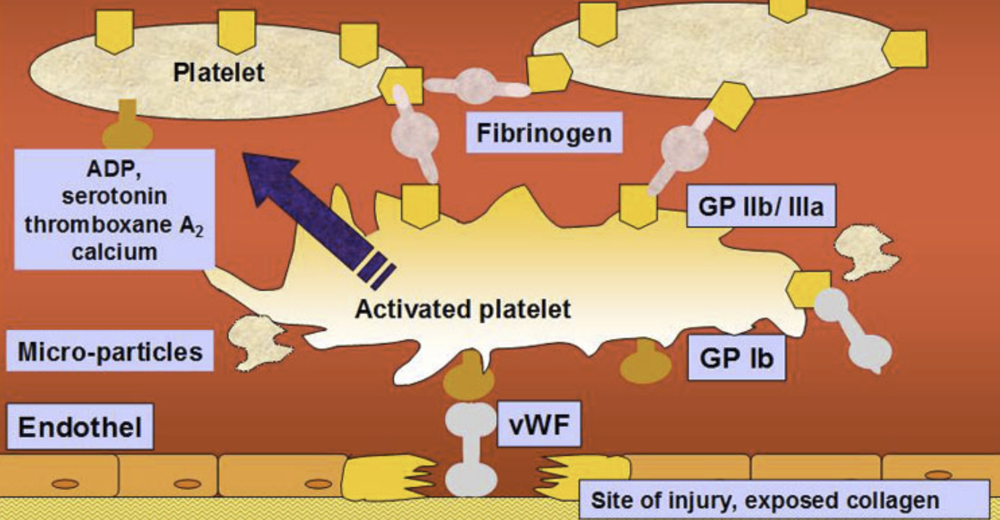

von Willebrand Factor    body {font-family: 'Open Sans', sans-serif;}

### von Willebrand Factor (vWF)

vWF is synthesized in megakaryocytes and endothelial cells.  
  
**Primary Function of von Willebrand Factor (vWF):  
**Promotes platelet binding to subendothelial tissue at the site of vascular injury.  
It mediates platelet-platelet interactions, promoting further clotting.  
Serves as a carrier protein for factor VIII, protecting it from proteolytic degradation in plasma.  
  
vWF is critical to the initial stages of blood clotting, acting as a bridge for platelet adhesion.  

****

Platelets clump together to plug the hole in a blood vessel. vWF acts like glue to help the platelet adhesion to form a blood clot.  

Von Willebrand Disease: Basic and Clinical Aspects; 2011  
by Augusto B. Federici, Christine A. Lee, Erik E. Berntorp, David Lillicrap and Robert R. Montgomery