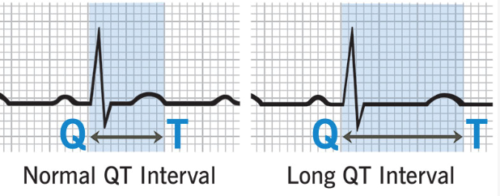

  Ondansetron (Zofran) section { margin-bottom: 20px; } table { border-collapse: collapse; } table, tr, th, td { border: 1px solid black; } th, td { padding: 0px 8px 0px 8px; text-align: left; vertical-align: top; } h3, p, ol.custom-counter, li { margin: 0px; padding: 0px; } .text-red { color: red; } .text-black { color: black; } ul.custom-dash { list-style: none; padding-left: 0; margin: 0; } ul.custom-dash > li { display: flex; align-items: flex-start; } ul.custom-dash > li::before { content: "–"; margin-right: 0.5em; flex-shrink: 0; line-height: 1; } ul.custom-dash > li > \*:not(::before) { flex: 1; } ul.custom-dash > li.no-dash::before { content: ""; width: 1em; margin-right: 0.5em; flex-shrink: 0; } /\* Change the ol style \*/ ol.custom-counter { list-style: none; padding-left: 0; counter-reset: custom calc(var(--start, 1) - 1); } ol.custom-counter li { counter-increment: custom; margin-bottom: 5px; } ol.custom-counter li::before { content: counter(custom) ") "; } /\* This is just for this file \*/ ul.custom-bullet-arrow { list-style: none; padding-left: 0; margin: 0; } ul.custom-bullet-arrow > li { display: flex; align-items: flex-start; } ul.custom-bullet-arrow > li::before { content: "↑"; margin-right: 0.5em; flex-shrink: 0; } ul.custom-bullet-arrow > li.no-arrow::before { content: ""; width: 0.5em; margin-right: 0.5em; flex-shrink: 0; } ul.custom-bullet\_arrow ul { list-style-type: disc; padding-left: 1.5em; margin-top: 0.5em; } img.resized-200 { width: 200px; height: auto; } img.resized-400 { width: 400px; height: auto; } img.resized-600 { width: 600px; height: auto; } .mb-10px { margin-bottom: 10px; } .mb-20px { margin-bottom: 20px; } .mt-10px { margin-top: 10px; } .mt-20px { margin-top: 20px; } .reference-notes { font-size: 11px; } .text-indent-45px { text-indent: 45px; } .text-bold { font-weight: bold; } .text-italic { font-style: italic; } .text-center { text-align: center; }

### Ondansetron (Zofran)

<table><tbody><tr><th style="width: 150px;">Class</th><td style="width: 450px;">
Serotonin 5-HT3 receptor antagonists

Antiemetic
</td></tr><tr><th>Indication</th><td>
To prevent and treat PONV, CINV, and RINV

CINV: Chemotherapy-induced nausea and vomiting

RINV: Radiation-induced nausea and vomiting

Off-label for:

Hyperemesis Gravidarum (pregnancy)

Severe refractory diarrhea associated with carcinoid tumors

Uremic Pruritus

Spinal Opioid Induced Pruritus

Rosacea
</td></tr><tr><th>Notes</th><td>
The FDA black box warning states that Zofran can increase the risk of QT prolongation.

Zofran should not be used in patients with a history of QT prolongation or in those who are taking other medications that can increase the risk of this condition.

Zofran is not effective for motion sickness because it does not act on the vestibular system.
</td></tr><tr><th>Action</th><td>
Acts both centrally and peripherally.

<b>Centrally:</b> Antagonizes 5-HT3 serotonin receptors in the “area postrema,” located on the floor of the fourth ventricle (contains the chemoreceptor trigger zone).

<b>Peripherally:</b> Works on the 5-HT3 receptors on vagus nerve terminals that synapse within the nucleus tractus solitarius of the brainstem. The vagus nerve can sense nausea and vomiting triggers within the GI tract, such as stomach irritants.
</td></tr><tr><th>Administration Timing</th><td>
End of procedure

Some anesthesia providers prefer to administer just prior to induction.
</td></tr><tr><th>Onset</th><td>
<b>IV:</b> rapid

PO: 15-30 minutes
</td></tr><tr><th>Peak</th><td>
<b>IV:</b> 25-60 minutes

PO: 1 hour
</td></tr><tr><th>Duration</th><td>
<b>IV:</b> 5-12 hours

PO: 8-12 hours
</td></tr><tr><th>½ life</th><td>
8 mg dose IV or PO: 3-4 hours

Elderly: 5.5 hours
</td></tr><tr><th>IV or IM Dose</th><td>
0.05-0.15 mg/kg

4-8 mg is recommended over 2-5 minutes.

Most anesthesia providers bolus Zofran.

<b>Note:</b> The FDA does not recommend a single dose greater than 16 mg IV due to the risk of QTc elongation.
</td></tr><tr><th>PO Dose</th><td>0.15 mg/kg</td></tr><tr><th>Peds Dose IV</th><td>0.05 - 0.1 mg/kg</td></tr><tr><th>Peak plasma (TMAX)</th><td>
IV: 10 minutes after 4mg (5-minute IV infusion)

PO: 1.5 hours after an 8 mg dose
</td></tr><tr><th>Metabolism</th><td>
95% by hepatic oxidation via Cytochrome P-450 enzymes (CYP3A4, CYP1A2, CYP2D6).
</td></tr><tr><th>Metabolites</th><td>
8-hydroxy Ondansetron (40%) – active

7-hydroxy Ondansetron (&lt;20%) – active

6-hydroxy Ondansetron (&lt;5%) – active

8-hydroxy Ondansetron is rapidly metabolized to glucuronide and sulfate conjugates in the liver.
</td></tr><tr><th>Elimination</th><td>Urine: The remaining 5% that was metabolized in the liver.</td></tr><tr><th>Clearance</th><td>
Adults: 0.351-5 L/h/kg

Peds: Higher

Infants: Less (underdeveloped cytochrome P450 system)
</td></tr><tr><th>Pregnancy class</th><td>B, safe</td></tr><tr><th>Breast feeding</th><td>Safe, minimal found in breast milk</td></tr><tr><th>Contraindications</th><td>
Hypersensitivity

Patients with history of QTc prolongation

With coadministration of:

apomorhine-profound hypotension

dronedarone-decreases metabolism

lefamulin-increases QT interval

posaconole-decreases metabolism
</td></tr><tr><th>Caution</th><td>
Avoid with pimozide due to risk of QTc prolongation.

Amiodarone may also prolong QTc interval.

Increased risk of serotonin syndrome when taking Ondansetron with other serotonergic medications.
</td></tr><tr><th>Side effects</th><td>Headache, diarrhea, fatigue, dry mouth, malaise, constipation</td></tr><tr><th>Possible adverse reactions</th><td>
QTc elongation (rare).

May occur within 1-2 hours after administration, returning to baseline within 24 hours.

IV administration has a higher risk of arrhythmias.
</td></tr><tr><th>Protein binding</th><td>70-80%</td></tr><tr><th>Vol of distribution</th><td>1.8 L/kg</td></tr></tbody></table>

Propofol and Ondansetron

Using propofol for induction and continuous infusion (TIVA) is almost as effective as Ondansetron

in preventing PONV (19% vs 26% respectively)

Administration of 4-8 mg of IV Ondansetron immediately prior to induction is highly effective in decreasing

the incidence of the following susceptible patient population (ambulatory gynecologic surgery and middle ear surgery).

Reversible, transient changes in the PR, QRS, and QT intervals have been consistently observed with 5-HT3 receptor antagonists; however, clinically relevant ECG changes have not been reported or documented.

ECG monitoring is recommended in patients with the following electrolyte abnormalities:

Hypokalemia or Hypomagnesemia

CHF

Bradyarrhythmias

Patients taking other medications that can lead to QT prolongation.

Zofran and QTc:

The corrected QT interval (QTc) is used when the heart rate exceeds 60 beats per minute (bpm).

A QTc interval of 440 ms is considered by many to be the upper limit of normal.

In patients with no evidence of cardiac dysfunction, a QTc of > 440 ms can be associated with a 2.3 times higher risk for sudden death compared with a QTc of < 440 ms.

QTc prolongation in itself is not harmful, but it increases the risk for developing a polymorphic ventricular arrhythmia aptly named torsades de pointes (TdP).

TdP can rapidly degenerate into ventricular fibrillation and cardiac arrest.

Ondansetron is well absorbed from the gastrointestinal tract and undergoes some first-pass metabolism.

Mean bioavailability in healthy subjects, following the administration of a single 8-mg tablet, is approximately 56%.

Serotonin Syndrome and Zofran:

The development of serotonin syndrome has been reported with the 5-HT3 receptor antagonists.

Most reports have been associated with concomitant use of serotonergic drugs:

Select serotonin reuptake inhibitors (SSRIs)

Serotonin and norepinephrine reuptake inhibitors (SNRIs),

MAO inhibitors

Mirtazapine

Fentanyl

Lithium

Tramadol

IV Methylene Blue

Some of the reported cases were fatal.

Zofran overdose:

Serotonin syndrome occurring with overdose of ZOFRAN alone has also been reported.

The majority of reports of serotonin syndrome related to 5-HT3 receptor antagonist use occurred in a post-anesthesia care unit or an infusion center.

Patients should be monitored for the emergence of serotonin syndrome, especially with concomitant use of ZOFRAN and other serotonergic drugs.

Because Ondansetron is metabolized by multiple hepatic cytochrome P-450 drug-metabolizing enzymes (CYP3A4, CYP2D6, CYP1A2), inducers or inhibitors of these enzymes may change the clearance and, hence, the half-life of Ondansetron.

Phenytoin, Carbamazepine, and Rifampin

In patients treated with potent inducers of CYP3A4 (i.e., phenytoin, carbamazepine, and rifampin), the clearance of Ondansetron was significantly increased, and ondansetron blood concentrations were decreased.

However, on the basis of available data, no dosage adjustment for Ondansetron is recommended for patients on these drugs

Antiemetics and QT Prolongation

Clinical Correlations 2021 (accessed 09/2025)

Ofer Fass, MD

https://www.clinicalcorrelations.org/2021/01/15/antiemetics-and-qt-prolongation/

Zofran Injectable

FDA (accessed 09/2025)

https://www.accessdata.fda.gov/drugsatfda\_docs/label/2014/020007s046lbl.pdf

Zofran Tablets

FDA (accessed 09/2025)

https://www.accessdata.fda.gov/drugsatfda\_docs/label/2011/020103s030,020605s014,020781s014lbl.pdf

Morgan & Mikhail’s Clinical Anesthesiology 7th Ed., 2022

CH.11, Neuromuscular Blocking Agents, p.218-222

Stoelting's Pharmacology and Physiology in Anesthesia Practice 6th ed. 2022

CH. 17, Adjuncts to Anesthesia, pp.283-284

Pamela Flood and James P. Rathmell

Ondansetron

StatPearls, 2023

National Library of Medicine (accessed 09/2025)

Alexandria Griddine; Jeffrey S. Bush

https://www.ncbi.nlm.nih.gov/books/NBK499839/

Ondansetron

DrugBank (accessed 09/2025)

https://go.drugbank.com/drugs/DB00904

Ondansetron

MedlinePlus (accessed 09/2025)

https://medlineplus.gov/druginfo/meds/a601209.html

Smith’s Anesthesia for Infants and Children 10th Ed, 2022

CH. 21: Induction, Maintenance, and Recovery, p. 453

Peter J Davis and Franklin P Cladis

Pediatric Guidelines for IV Medication Administration

US Mass General Medical Center-Anesthesiology Files (accessed 09/2025)

https://www.umassmed.edu/globalassets/anesthesiology/files/resources/2016-resources/pediatric-guidelines-for-medications.pdf

ondansetron (Rx)

Medscape (accessed 09/2025)

https://reference.medscape.com/drug/ondansetron-342052#0